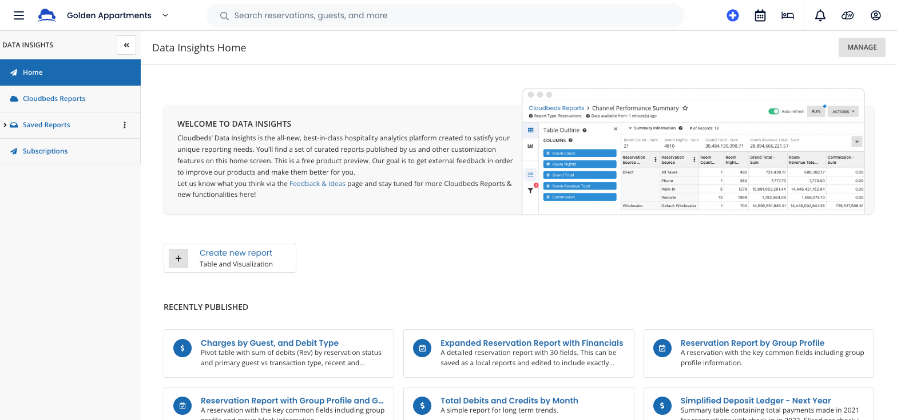

<h1>Interacting with Cloudbeds Report Builder</h1>


- [**Intro to Data Insights**](#intro-to-data-insights)
- [**How to Authenticate**](#how-to-authenticate)
- [**Background Info**](#background-info)
    - [**Italian Tourism Report**](#italian-tourism-report)
- [**Interacting withCloudbeds Report Builder**](#interacting-withcloudbeds-report-builder)
    - [**Query Available Datasets**](#query-available-datasets)
- [**The Raw Reports**](#the-raw-reports)
- [**Query Report Data**](#query-report-data)
- [**Conclusion**](#conclusion)
- [*Reference info*](#reference-info)
    - [*Statistics Report Data Fields*](#statistics-report-data-fields)

<br/>

## **Intro to Data Insights**

So you've got some data at Cloudbeds and you're ready to use it! You will find flexibility and functionality in the Data Insights Report Builder tool.



But if you want to take full advantage of the rich datasets provided by Cloudbeds, then this guide will provide a simple introduction to the API and how to build you own automation.

- For full descriptions of the API usage, check out our [API Documentation](https://api.cloudbeds.com/datainsights)

<br/>

## **How to Authenticate**

This guide is intended to provide an introduction to the API, but in order to interact with the service, you will need a Client ID and Client Secret. Please follow this [guide for generating API credentials](https://myfrontdesk.cloudbeds.com/hc/en-us/articles/1260801405770-cloudbeds-release-self-service-api-jan-2021).

- Note: for multi-property credentials, follow [this guide](https://integrations.cloudbeds.com/hc/en-us/articles/360012140013-Property-and-Group-Account-API-Access)

<br/>

## **Background Info**

In many countries, there are strict reporting requirements for hotels and rental properties. This can require manually collecting  data  from the different sources and merging them into a single document for government submittal.

The Data Insights API provides a single interface for accessing and utilizing all of the data from your property, saving precious time. And building your own automation around this data can streamline critical reporting operations.

#### **Italian Tourism Report**

In this tutorial we will demonstrate how our data can be used to generate a report for the Italian Ministry of Tourism. This report can be used in the ROSS 1000 Italian Statistical Information System, which is a national reference system.

- To read more about ROSS 1000 [Click Here](https://www.ross1000.it/#b3334)

<br/>

## **Interacting withCloudbeds Report Builder**
In order to build a report, we need a few things. First, you need to understand the format of Cloudbeds reports. The reports are constructed using JSON to specify the Cloudbeds Data Fields to be included, filters to be applied to that data, and many other features that allow you to customize your results. Check out all of the documentation [HERE](https://api.cloudbeds.com/datainsights#/Reports/post_v1_1_reports) to better understand how to create a report.

#### **Query Available Datasets**
Each report is built using a single dataset. And to collect the data needed for the the Italian Government, we will need to pull from multiple datasets: Guests and Occupancy.

- To check which datasets are available to you, query the endpoint specified in [this documentation](https://api.cloudbeds.com/datainsights#/Datasets/get_v1_1_datasets).

```Python
# Required Headers
headers = {
    "ACCEPT-LANGUAGE": "en",
    "X-PROPERTY-ID": str(YOUR_PROPERTY_ID),
    "Authorization": f"Bearer {YOUR_AUTH_TOKEN}",
}

# Get Datasets and print results
datasets_response = requests.get(
    "https://api.cloudbeds.com/datainsights/v1.1/datasets", headers=headers
)
for dataset in datasets_response.json():
    print(f"ID: {dataset['id']}, Name: {dataset['name']}")
```

Each dataset will have a set of Cloudbeds Data Fields for you to use in your report. Using the dataset ID, you can send another request to [get the corresponding Cloudbeds Data Fields](https://api.cloudbeds.com/datainsights#/Datasets/get_v1_1_datasets__dataset_id_).

```Python
# Required Headers
headers = {
    "ACCEPT-LANGUAGE": "en",
    "X-PROPERTY-ID": str(YOUR_PROPERTY_ID),
    "Authorization": f"Bearer {YOUR_AUTH_TOKEN}",
}

# Get Cloudbeds Data Fields (CDFs)
dataset_cdfs_response = requests.get(
    "https://api.cloudbeds.com/datainsights/v1.1/datasets/1", headers=headers
)
for category in dataset_cdfs_response.json()["cdfs"]:
    print(f"Category: {category['category']}")
    for cdf in category["cdfs"]:
        print(
            f"Cloudbeds Data Field Name: {cdf['name']}, Cloudbeds Data Column: {cdf['column']}"
        )
```

<br/>

## **The Raw Reports**
To collect the data needed for the Italian statistics form, you will need to generate three reports from two datasets. You can query the API and pick out the data fields you would like to use, but for this example we've done the work for you!

Below you'll find the three example reports, set as python variables, that we will later use in code to query the data. Just send them as your payload, with the required authentication headers, and you'll have the data you need to build the Italian Tourism Statistics report.

**Guest Information**
In this example, we've set the filters for the month of February, 2023, but of course you can set the filters to the date range you need.
```Python
GUEST_INFO_REPORT = {
    "property_ids": [
        YOUR_PROPERTY_ID,
    ],
    "dataset_id": 2,
    "filters": {
        "and": [
            {
                "cdf": {"type": "default", "column": "checkin_date"},
                "value": "yesterday",
                "operator": "greater_than_or_equal",
            }
        ]
    },
    "columns": [
        {"cdf": {"column": "italian_guest_type"}},
        {"cdf": {"column": "checkin_date"}},
        {"cdf": {"column": "guest_surname"}},
        {"cdf": {"column": "guest_first_name"}},
        {"cdf": {"column": "guest_gender"}},
        {"cdf": {"column": "guest_birth_date"}},
        {"cdf": {"column": "italian_guest_birth_date_municipality_code"}},
        {"cdf": {"column": "italian_guest_birth_date_province_code"}},
        {"cdf": {"column": "italian_guest_birth_country_code"}},
        {"cdf": {"column": "italian_guest_nationality_code"}},
        {"cdf": {"column": "guest_city"}},
        {"cdf": {"column": "guest_state"}},
        {"cdf": {"column": "guest_residence_country"}},
        {"cdf": {"column": "guest_address"}},
        {"cdf": {"column": "guest_document_type"}},
        {"cdf": {"column": "guest_document_number"}},
        {"cdf": {"column": "italian_guest_document_issuing_province_code"}},
        {"cdf": {"column": "italian_guest_document_issuing_municipality_code"}},
        {"cdf": {"column": "guest_document_issuing_country_code"}},
        {"cdf": {"column": "checkout_date"}},
    ],
    "settings": {"details": True, "totals": False, "transpose": False},
}
```

**Occupied Rooms**
In this report, you'll see that we've also included grouping by rows. This will sum the data into totals per day.
```Python
OCCUPIED_ROOMS = {
    "property_ids": [22425],
    "dataset_id": 4,
    "filters": {
        "and": [
            {
                "value": "2023-02-01T00:00:00.000Z",
                "cdf": {"type": "default", "column": "stay_date"},
                "operator": "greater_than_or_equal",
            },
            {
                "value": "2023-02-28T00:00:00.000Z",
                "cdf": {"type": "default", "column": "stay_date"},
                "operator": "less_than_or_equal",
            },
        ]
    },
    "columns": [{"cdf": {"column": "booking_qty_type_a"}, "metrics": ["sum"]}],
    "settings": {"totals": False, "details": False},
    "group_rows": [{"cdf": {"column": "stay_date"}, "modifier": "day"}],
    "custom_cdfs": [],
}
```

**Unoccupied Rooms and Beds**
And finally in this report, we add one more filter to remove any of the rooms that are occupied before getting the total unoccupied rooms and beds per day.
```Python
UNOCCUPIED_ROOMS = {
    "property_ids": [
        YOUR_PROPERTY_ID,
    ],
    "dataset_id": 4,
    "filters": {
        "and": [
            {
                "value": "2023-02-01T00:00:00.000Z",
                "cdf": {"type": "default", "column": "stay_date"},
                "operator": "greater_than_or_equal",
            },
            {
                "value": "2023-02-28T00:00:00.000Z",
                "cdf": {"type": "default", "column": "stay_date"},
                "operator": "less_than_or_equal",
            },
            {
                "value": "0",
                "cdf": {"type": "default", "column": "booking_qty_type_a"},
                "operator": "equals",
            },
        ]
    },
    "columns": [
        {"cdf": {"column": "room_available_type_a"}, "metrics": ["sum"]},
        {"cdf": {"column": "bed_based_capacity"}, "metrics": ["sum"]},
    ],
    "settings": {"totals": False, "details": False},
    "group_rows": [{"cdf": {"column": "stay_date"}, "modifier": "day"}],
    "custom_cdfs": [],
}
```

<br/>

## **Query Report Data**
With your new reports variables set, you can simply use the `requests` package for Python to query the data. We will provide here a simple script to query the 3 individual reports and display the data from them using the "pretty printer" `pprint`.

```Python
# Set up the pretty printer
printer = pprint.PrettyPrinter(indent=4)

# Required Headers
headers = {
    "ACCEPT-LANGUAGE": "en",
    "X-PROPERTY-ID": str(YOUR_PROPERTY_ID),
    "Authorization": f"Bearer {YOUR_AUTH_TOKEN}",
}

# Query parameters for the request
query_params = dict(
    mode="Run",  # Other option is "Preview", which limits the result to 10,000 records
)

# Query the Guest Information report
print("Querying the Guest Information data...")
report_query_response = requests.post(
    "https://api.cloudbeds.com/datainsights/v1.1/reports/query/data",
    params=query_params,
    headers=headers,
    json=GUEST_INFO_REPORT,
)
printer.pprint(report_query_response.json())

# Query the Occupied Rooms report
print("Querying the Occupied Rooms data...")
report_query_response = requests.post(
    "https://api.cloudbeds.com/datainsights/v1.1/reports/query/data",
    params=query_params,
    headers=headers,
    json=OCCUPIED_ROOMS,
)
printer.pprint(report_query_response.json())

# Query the Unoccupied Rooms report
print("Querying the Unoccupied Rooms data...")
report_query_response = requests.post(
    "https://api.cloudbeds.com/datainsights/v1.1/reports/query/data",
    params=query_params,
    headers=headers,
    json=UNOCCUPIED_ROOMS,
)
printer.pprint(report_query_response.json())

```

That's it!

From here you can take the results and build your own Italian Tourism Statistics Report in whatever format your business needs.

<br/>

## **Conclusion**
Now you have the data you need in an easy to use data structure and begin to build your own automation, visualization, business intelligence, reporting... or whatever you need to simplify your operation and make decisions informed by data.

<br/>

## *Reference info*

#### *Statistics Report Data Fields*
We've marked all of the Italian report fields that map to a corresponding Cloudbeds Data Field. *(N/A for Not Available)*

| Field Name | CDF Name | Dataset |
| ---------- |:--------:| -------:| 
| Guest type | Italian Guest Type | Currently in the Italy police report / specific Italy data  |
| Arrival date | Check in date | Guest |
| Last Name | Guest Surname | Guest |
| First Name | Guest First Name | Guest |
| Gender | Guest Gender | Guest |
| Date of birth | Guest birth date | Guest |
| Municipality of birth | Italian Guest Birth Date Municipality Code | Currently in the Italy police report / specific Italy data  |
| Italian Province of birth | Italian Guest Birth Date Province Code | Currently in the Italy police report / specific Italy data  |
| Country of birth | Italian Guest Birth Country Code | Currently in the Italy police report / specific Italy data  |
| Nationality | Italian Guest Nationality Code | Currently in the Italy police report / specific Italy data  |
| Municipality of residence | Guest city | Guest |
| Province of residence | Guest state | Guest |
| Country of residence | Guest country | Guest |
| Address line 1 | Guest address line 1 | Guest |
| Type of ID document | Guest Document Type | Guest |
| ID Number | Guest Document number | Guest |
| Place of issue Province | Guest document issuing province code | Currently in the Italy police report / specific Italy data  |
| Place of issue Municipality | Guest document issuing municipality code | Currently in the Italy police report / specific Italy data  |
| Place of issue (Country, for non-Italians) | Guest document issuing country Code | Guest |
| Check out date | Check out date | Guest |
| Tourism type | | *N/A* |
| Means of transport | | *N/A* |
| Occupied rooms (on the report day) | | Occupancy |
| Available rooms (on the report day) | | Occupancy |
| Available beds (on the report day) | | Occupancy |
| Tourist tax | | *N/A* |

<br/>
